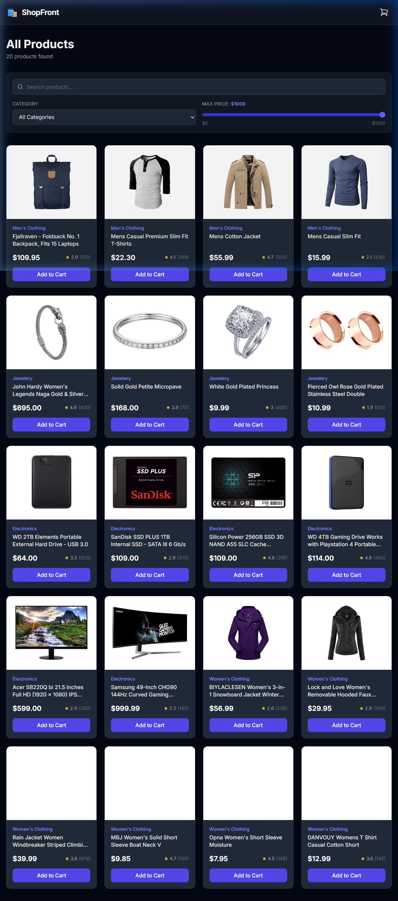
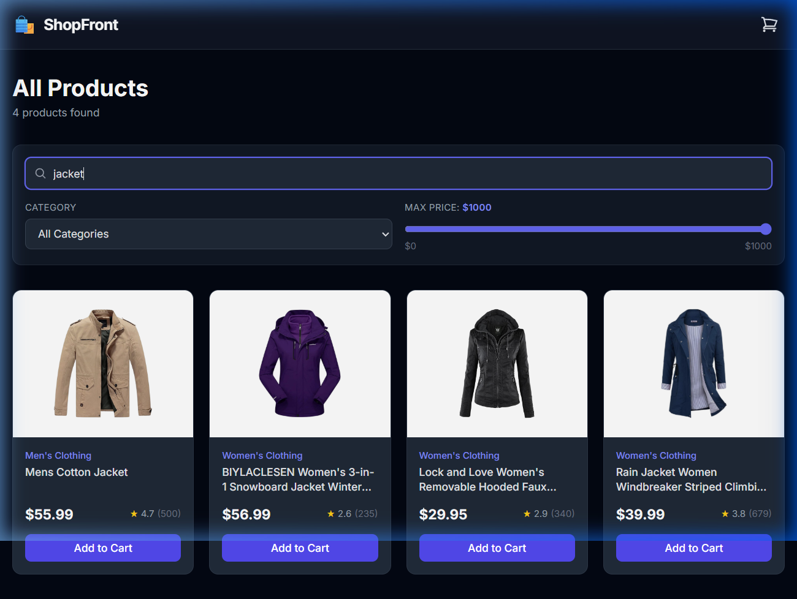
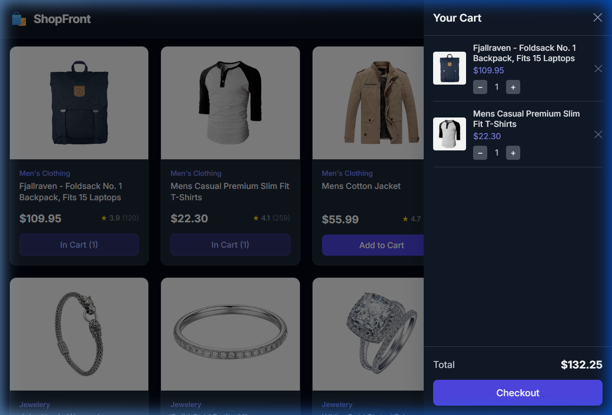

# ShopFront — E-Commerce Storefront

Live Demo: https://ecommerce-storefront-livid.vercel.app

## Screenshots







## About This Project

ShopFront is a small e-commerce product listing page I built as a portfolio project while applying for frontend developer internships. It fetches real product data from [FakeStoreAPI](https://fakestoreapi.com/), lets you search and filter through them, and has a working cart with a live total. Everything runs in the browser — no backend, no database.

## Tech Stack

- **React 18** — UI and component logic
- **Vite** — dev server and build tool
- **Tailwind CSS** — utility-first styling
- **FakeStoreAPI** — product and category data
- **Context API** — cart state shared across components

## Features

- Browse all products in a responsive grid
- Live search by product title (no button needed, updates as you type)
- Filter by category using a dropdown
- Filter by max price using a range slider
- All three filters combine together simultaneously
- Cart sidebar/drawer with item list, quantity controls, and a live total
- Cart icon in the navbar shows total item count
- Loading state while fetching, error message if the API fails
- "No products found" message when filters return nothing

## Challenges / What I Learned

**Combining three filters without them breaking each other** — The trickiest part was making search, category, and price all filter at the same time. At first I was trying to chain `.filter()` calls in separate effects and things kept getting out of sync. The fix was simple: compute `filteredProducts` directly in the render using a single `.filter()` that checks all three conditions at once, with the raw `products` array always staying untouched.

**Sharing cart state across components without prop drilling** — Early on I was passing `cartItems` and `handleAddToCart` as props through multiple layers. It got messy fast. Switching to Context API (`CartContext`) meant any component — `Navbar`, `ProductCard`, `CartItem` — could just call `useCart()` and get what it needed, without passing anything through the middle.

**Getting the live total to recalculate correctly on quantity changes** — I initially computed the total inside the cart and stored it in state, which caused stale value bugs when quantities changed quickly. The fix was to not store it in state at all — just derive it directly from `cartItems` using `.reduce()` on every render. Since React re-renders whenever `cartItems` changes, the total is always fresh.

## Run Locally

```bash
# Clone the repo
git clone https://github.com/AtulSharmx/Ecommerce-Storefront.git
cd Ecommerce-Storefront

# Install dependencies
npm install

# Start the dev server
npm run dev
```

Open [http://localhost:5173](http://localhost:5173) in your browser.
